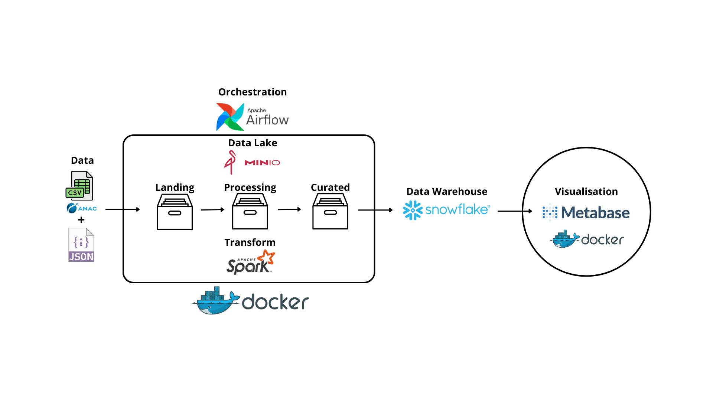

# Data Pipeline ETL com as principais features: Airflow, PySpark e Snowflake
## Toda a descrição (passo a passo) deste projeto está disponibilizado neste post: [Medium](https://medium.com/@danilojpfreitas/data-pipeline-etl-com-as-principais-features-airflow-pyspark-e-snowflake-17e9709d0d51)

---

Neste projeto foi construido um Data Pipeline ETL completo para a avaliação dos preços das passagens áreas de Maceió para outras cidades do Brasil → Inclusive todo o processo pode ser replicado para outras cidades do Brasil e do Mundo!

## :bulb: Data Pipeline


# :memo: Etapas do projeto:
## :flight_arrival: Instalação dos Contêineres Docker (Minio, Airflow, Metabase)

1. Minio

O primeiro passo é a instalação do contêiner Docker do Minio, foram selecionado as portas 9000 e 9001 com a execução do comando bash abaixo:

```
docker run — name minio -d -p 9000:9000 -p 9001:9001 -v “$PWD/datalake:/data” minio/minio server /data — console-address “:9001”
```
Caso o seu ambiente de desenvolvimento não tenha as imagens, elas serão baixadas automaticamente.

2. Airflow

Em seguida o mesmo procedimento deve ser executado para a instalação do contêiner Airflow:

```
docker run -d -p 8080:8080 -v “$PWD/airflow/dags:/opt/airflow/dags/” — entrypoint=/bin/bash — name airflow apache/airflow:2.1.1-python3.8 -c ‘(airflow db init && airflow users create — username admin — password admin — firstname Danilo — lastname Lastname — role Admin — email admin@example.org); airflow webserver & airflow scheduler’
```
No comando bash deve ser determinado o user e o password, por padrão no ambiente de desenvolvimento foi selecionado o `admin` para ambos.

3. Metabase

Já para o metabase foi criado um diretório, baixada a imagem docker do metabase e por último o contêiner foi montado:

```
mkdir metabase
cd metabase
wget https://raw.githubusercontent.com/danilojpfreitas/DataPipeline-airbyte-dbt-airflow-snowflake-metabase/main/metabase/docker-compose.yaml
docker-compose up
cd ..
```

## :file_folder: Extração dos dados

Os dados utilizados foram extraídos diretamente do acervo público disponível pela Agência Nacional de Aviação Civil (ANAC) - Link [1](https://www.anac.gov.br/acesso-a-informacao/dados-abertos/areas-de-atuacao/voos-e-operacoes-aereas/registro-de-servicos-aereos) e [2](https://www.anac.gov.br/acesso-a-informacao/dados-abertos/areas-de-atuacao/voos-e-operacoes-aereas/dados-estatisticos-do-transporte-aereo). Além dos dados CSVs da ANAC foi utilizado um JSON disponível no GitHub do projeto com o nome das cidades e o seu código ICAO.


Após serem baixados os arquivos foram depositados na camada landing do Minio.

Para isso é necessário acessar o Minio localmente pelo `http://localhost:9001/login` e em seguida logar com o user e password padrão `minioadmin`.

Após o acesso aos buckets do Minio devem ser criados as zonadas do Data Lake do projeto (landing, processing e curated). Por fim foi executado o uploald dos arquivos.


## :fast_forward: Transformação dos dados (Airflow, Minio e PySpark)

Para a modelagem/transformação dos dados foi desenvolvido dentro de um notebook (ambiente de desenvolvimento) os comandos com o PySpark para a modelagem das tabelas. Realizando o tratamento dos Schemas, junção de tabelas e seleção dos dados utilizados por esse projeto.


O Data Lake é composto pelas seguintes etapas:


1. Landing: Todos as tabelas foram extraídos com o PySpark;
2. Processing: Os Schemas e suas propriedades foram ajusatadas e todas as tabelas foram depositadas no formato Parquet;
3. Curated: Transformação/Modelagem das tabelas para o seu envio ao Snowflake (Data Warehouse).
   
Após a etapa de desenvolvimento do código PySpark, foi construido dentro de uma DAG do Airflow a orquestração do processo. Da captação das tabelas em diferentes formatos (CSV e JSON), transformação/modelagem até o seu depósito no Snowflake.

**Etapas para a construção da DAG do Airflow:**

1. Importação de algumas bibliotecas necessárias para o projeto:

```
from datetime import datetime,date, timedelta
from airflow import DAG
from airflow.operators.python_operator import PythonOperator
from airflow.models import Variable
from minio import Minio
from pyspark.sql import SparkSession
from pyspark.sql.types import DoubleType, IntegerType 
from pyspark.sql import functions as f
import findspark
```

2. Configuração da DAG do Airflow:

```
DEFAULT_ARGS = {
    'owner': 'Airflow',
    'depends_on_past': False,
    'start_date': datetime(2019, 1, 1),
}

dag = DAG('etl_data', 
          default_args=DEFAULT_ARGS,
          schedule_interval="@once"
        )
```

3. Variáveis para a conexão com o Minio no Airflow

```
data_lake_server = Variable.get("data_lake_server")
data_lake_login = Variable.get("data_lake_login")
data_lake_password = Variable.get("data_lake_password")
```

4. Configuração de acesso ao Minio

```
client = Minio(
        data_lake_server,
        access_key=data_lake_login,
        secret_key=data_lake_password,
        secure=False  
      )
```

5. Inicialização e configurações gerais para o PySpark. Incluindo as configurações para a conexão com o Snowflake.

```
#Start Spark
findspark.init()

spark = SparkSession.builder.appName("Snowflake-Connection").master('local[*]').config("spark.jars", "/opt/airflow/path/spark-snowflake_2.12-2.9.3-spark_3.1.jar,/opt/airflow/path/snowflake-jdbc-3.13.10.jar").getOrCreate()
spark.sparkContext.addPyFile("/opt/airflow/path/spark-snowflake_2.12-2.9.3-spark_3.1.jar")
spark.sparkContext.addPyFile("/opt/airflow/path/snowflake-jdbc-3.13.10.jar")

SNOWFLAKE_SOURCE_NAME= "net.snowflake.spark.snowflake"
```

6. Configurações para acesso ao Snowflake pelo PySpark

```
#snowflake
sfOptions = {
  "sfURL" : "***",
  "sfAccount" : "***",
  "sfUser" : "***",
  "sfPassword" : "***",
  "sfDatabase" : "***",
  "sfSchema" : "***",
  "sfWarehouse" : "***"
}
```
Toda a DAG e a função dela esta disponível no repo [GitHub](https://github.com/danilojpfreitas/DataPipeline-TarifasAereas/blob/main/airflow/dags/etl_data.py).

**Configuração do contêiner Airflow**

Antes da execução da DAG é necessário executar alguns passos dentro do contêiner do Airflow, entre eles algumas dependências para o seu completo funcionamento.

Para isso é necessário acessar o root do contêiner Airflow comando:

```
docker container exec -it -u root airflow bash
```

Dentro do contêiner é necessário instalar a dependências:

```
pip install pymysql xlrd openpyxl minio pyspark findspark install-jdk
```

```
apt update && \
apt-get install -y openjdk-11-jdk && \
apt-get install -y ant && \
apt-get clean;
```
Para o funcionamento a conexão do Snowflake com o PySpark é necessário acrescentar dentro do contêiner Airflow dois arquivos. Algumas etapas devem ser executadas para isso:

- Instalação do PySpark e Wget:

```
pip install pyspark
apt install wget
```

- Criação de um diretório

```
mkdir path
cd path
```

- Carregamento de dois arquivos dentro do diretório

```
wget https://repo1.maven.org/maven2/net/snowflake/spark-snowflake_2.12/2.9.3-spark_3.1/spark-snowflake_2.12-2.9.3-spark_3.1.jar
wget https://repo1.maven.org/maven2/net/snowflake/snowflake-jdbc/3.13.10/snowflake-jdbc-3.13.10.jar
pyspark --packages net.snowflake:snowflake-jdbc:3.8.0,net.snowflake:spark-snowflake_2.11:2.4.14-spark_2.4
```

**Acessando o Airflow e registrando as variáveis do Minio**

O acesso local do Airflow `http://localhost:8080/`. Ao acessar o user e password são autenticados com o padrão `admin`.

Dentro o Airflow é necessário cadastrar as variáveis do Minio. Em relação a variável `data_lake_server` é necessário observar em qual IpAddress o Minio esta localizado, essa informação pode ser obtida por comando bash `docker inspect minio`.

Variáveis do Minio no Airflow:


Agora com todos os passos executados é possível executar a DAG e obter ter no Snowflake as tabelas obtidas pelo processo ETL.

Obs.: É necessário descrever as configurações do Snowflake dentro da DAG em sfOptions!

Ambiente Airflow com a orquestração do processo ETL:


## :snowflake: Snowflake

Após a realização da extração e transformação, 4 tabelas foram carregadas e disponibilizadas no Snowflake.


## :eye: Visualização dos dados pelo Metabase

Com a chegada de todos os dados no Snowflake (Data Warehouse), as tabelas foram conectadas com o Metabase para a criação de um ambiente de visualização.



A conexão do Snowflake com o Metabase é realizado com os seguinte passos:

- Acessar o Metabase localmente pelo `http://localhost:3000/`;
- Selecionar Snowflake como o Banco de Dados;
- Adicionar os dados de conexão com o Snowflake:


Após a realização de todas as etapas será possível utilizar as tabelas do Snowflake no Metabase :)


## :rocket: Conclusão

A partir da construção desse Data Pipeline ETL é possível extrair importantes insights sobre os preços e outras variáveis das passagens aéreas pelo Brasil ou porque não pelo Mundo!

Todo processo é orquestrado pelo Airflow permitindo a atualização constante dos dados ao passar dos anos. Além disso o ambiente do Snowflake permite uma rápida conexão para que outros estudiosos de dados possam criar mais insights!

Me siga no [Linkedin](https://www.linkedin.com/in/danilo-freitas-dev/) para acompanhar novos artigos e dicas!

---
